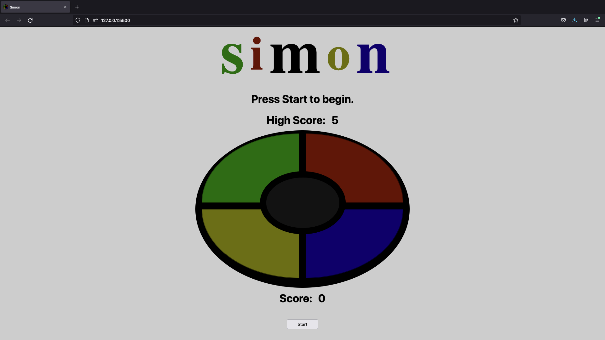

# Simon

A web browser version of the Milton Bradley(now Hasbro) game.  The board will play a sequence of lights that the player will try to follow.

If the player matches the board's sequence, the board will play the previous sequence plus another light.

If the player gets a sequence wrong, but has a new high score, there will be a celebration and the game will reset.

Otherwise, they will just have to try again.  

---

## Getting Started:

You can play [*here*](https://awatersny.github.io/simon/).

---
## Screenshots:

### Desktop Display

---

### Mobile Display
<image src="./screenshots/Mobile-Display.jpg" width="180"/>
<image src="./screenshots/Comp-Turn.jpg" width="180"/>
<image src="./screenshots/Congrats.jpg" width="180"/>

---

## Technologies Used:

---
## Planned Enhancements:

- Keyboard functionality
- Mobile landscape styling
- iOS Safari sound support